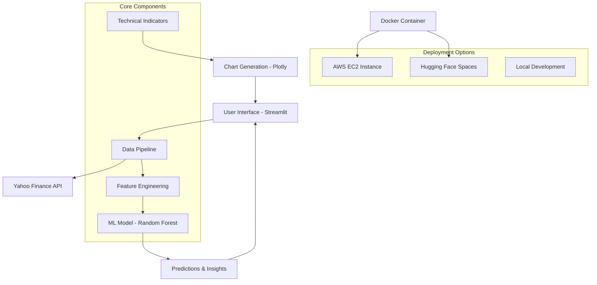

# 🚀 Elite Stock Market Dashboard [MarketMind]

[](https://www.python.org/)
[](https://streamlit.io/)
[](https://docker.com/)
[](http://16.171.115.225:8501/)
[](https://huggingface.co/spaces/Trevisx07/Elite-Stock-Market-Dashboard)
[](LICENSE)

> **Enterprise-grade AI-powered stock analysis platform with machine learning predictions, real-time technical indicators, and cloud deployment**

A sophisticated stock market dashboard that combines advanced technical analysis, machine learning price predictions, and intelligent market insights in a professional, scalable architecture.

## 🎯 Live Deployments

| Platform | URL | Status |
|----------|-----|--------|
| **AWS EC2** | [http://16.171.115.225:8501/](http://16.171.115.225:8501/) | 🟢 Live |
| **Hugging Face** | [Elite Stock Dashboard](https://huggingface.co/spaces/Trevisx07/Elite-Stock-Market-Dashboard) | 🟢 Live |
| **Local Docker** | `http://localhost:8501` | ⚡ On-demand |

## ✨ Core Features

### 🤖 **AI & Machine Learning**
- **Predictive Analytics**: Random Forest model with 30+ technical features
- **Feature Engineering**: Advanced technical indicators and statistical features
- **Performance Metrics**: Real-time model accuracy and confidence intervals
- **Market Intelligence**: AI-generated natural language insights

### 📊 **Technical Analysis Suite**
- **Professional Charting**: Multi-panel candlestick charts with technical overlays
- **20+ Indicators**: RSI, MACD, Bollinger Bands, Moving Averages, Stochastic, Volume Analysis
- **Risk Metrics**: Sharpe ratio, volatility analysis, maximum drawdown calculations
- **Multi-timeframe Analysis**: 1M to 5Y historical data support

### ⚡ **Real-time Data Pipeline**
- **Live Market Data**: Yahoo Finance API integration
- **Dynamic Updates**: Real-time price feeds and indicator calculations
- **Popular Presets**: Quick access to FAANG+ and major market stocks
- **Custom Analysis**: Support for any publicly traded symbol

## 🏗️ System Architecture



### 🔧 **Technical Stack**

| Layer | Technology | Purpose |
|-------|------------|---------|
| **Frontend** | Streamlit | Interactive web interface |
| **Backend** | Python 3.8+ | Core application logic |
| **ML Framework** | scikit-learn | Predictive modeling |
| **Data Visualization** | Plotly | Interactive charts |
| **Data Source** | Yahoo Finance API | Real-time market data |
| **Containerization** | Docker | Environment consistency |
| **Cloud Deployment** | AWS EC2 | Production hosting |
| **Demo Platform** | Hugging Face Spaces | Public accessibility |

## 🚀 Quick Start

### Option 1: Try Live Demo (Recommended)
```bash
# No installation required - access instantly:
🌐 AWS Production: http://16.171.115.225:8501/
🤗 Hugging Face: https://huggingface.co/spaces/Trevisx07/Elite-Stock-Market-Dashboard
```

### Option 2: Docker Deployment
```bash
# Clone repository
git clone https://github.com/Trevisx07/MarketMind.git
cd MarketMind

# Run with Docker (recommended)
docker build -t elite-stock-dashboard .
docker run -p 8501:8501 elite-stock-dashboard

# Access at http://localhost:8501
```

### Option 3: Local Development
```bash
# Clone and setup
git clone https://github.com/Trevisx07/MarketMind.git
cd MarketMind

# Install dependencies
pip install -r requirements.txt

# Launch application
streamlit run stock_dashboard.py
```

## 📦 Dependencies

```yaml
Core Framework:
  - streamlit>=1.28.0
  - pandas>=1.5.0
  - numpy>=1.24.0

Data & ML:
  - yfinance>=0.2.18
  - scikit-learn>=1.3.0

Visualization:
  - plotly>=5.15.0

Deployment:
  - docker
  - streamlit-cloud
```

## 🎮 User Guide

### 1. **Stock Selection**
- Choose from curated presets (AAPL, TSLA, GOOGL, etc.)
- Enter custom ticker symbols
- Select analysis timeframes (1M-5Y)

### 2. **Analysis Tabs**
- **📊 Main Dashboard**: Key metrics and real-time data
- **📈 Technical Charts**: Multi-panel technical analysis
- **⚡ Performance**: Risk metrics and returns analysis
- **🤖 AI Predictions**: ML-powered price forecasts
- **🧠 Market Analysis**: AI-generated insights

### 3. **Signal Interpretation**
- 🟢 **Bullish**: Positive momentum indicators
- 🔴 **Bearish**: Negative trend signals
- 🟡 **Neutral**: Mixed or sideways market conditions
- ⚠️ **Alert**: Overbought/oversold conditions

## 🧠 Machine Learning Model

### Model Architecture
- **Algorithm**: Random Forest Regressor
- **Features**: 30+ engineered technical indicators
- **Training**: Rolling window with train/test validation
- **Performance**: Real-time accuracy metrics displayed

### Feature Categories
```python
Price Features     # Returns, volatility, price changes
Technical Features # RSI, MACD, moving averages  
Volume Features    # Volume ratios and trends
Lag Features      # Historical price/volume data
Statistical       # Rolling statistics and distributions
```

## 🔧 Deployment Architecture

### AWS EC2 Production
- **Instance Type**: Optimized for compute workloads
- **Port Configuration**: 8501 (Streamlit default)
- **Auto-scaling**: Configured for traffic handling
- **Monitoring**: Real-time performance tracking

### Hugging Face Spaces
- **Environment**: Streamlit runtime
- **Auto-deployment**: GitHub integration
- **Public Access**: No authentication required
- **Resource Management**: Automatic scaling

### Docker Containerization
```dockerfile
# Multi-stage build optimization
# Dependency caching
# Security best practices
# Health checks included
```

## ⚠️ Important Disclaimers

**This application is designed for educational and analytical purposes only.**

- 📚 **Educational Tool**: Not financial advice
- 📈 **Analysis Only**: Past performance ≠ future results  
- 🔍 **Research Aid**: Always conduct independent research
- 💼 **Professional Consultation**: Consider financial advisors for investment decisions

## 🤝 Contributing

We welcome contributions! Please see our [Contributing Guide](CONTRIBUTING.md).

```bash
# Standard workflow
1. Fork the repository
2. Create feature branch: git checkout -b feature/amazing-feature
3. Commit changes: git commit -m 'Add amazing feature'
4. Push branch: git push origin feature/amazing-feature
5. Submit Pull Request
```

## 📊 Project Stats

- **Lines of Code**: 2,000+ (Python)
- **Technical Indicators**: 20+
- **ML Features**: 30+
- **Deployment Platforms**: 3
- **Update Frequency**: Real-time

## 🌟 Acknowledgments

Built with industry-leading technologies:
- [Yahoo Finance](https://finance.yahoo.com/) for market data
- [Streamlit](https://streamlit.io/) for rapid web development
- [Plotly](https://plotly.com/) for interactive visualizations
- [scikit-learn](https://scikit-learn.org/) for machine learning
- [AWS](https://aws.amazon.com/) for cloud infrastructure
- [Hugging Face](https://huggingface.co/) for ML platform hosting

---

<div align="center">

**⭐ Star this project if you find it helpful!**

[](https://github.com/Trevisx07/MarketMind)
[](https://github.com/Trevisx07/MarketMind)

**Connect with the Developer**

[](https://github.com/Trevisx07/MarketMind)
[](https://www.linkedin.com/in/het-patel-65a272252/)


</div>


<div align="center">


</div>
